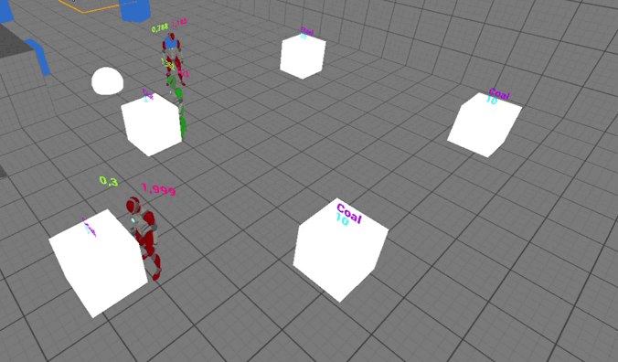
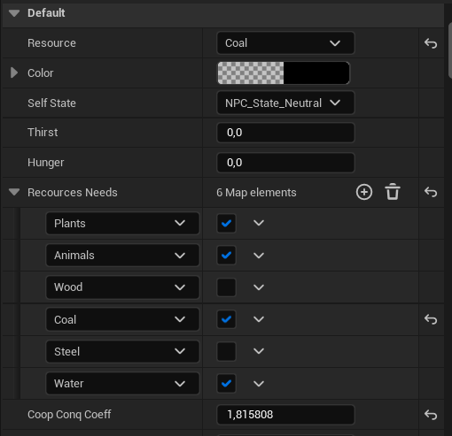
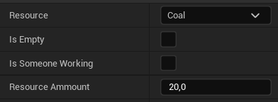

# Разработка и исследование алгоритма моделирования социальных процессов неигровых персонажей 
В данной работе представлена модель симуляции кооперации и конкуренции неигровых персонажей в зависимости от состояния природной среды и наличия природных ресурсов. Алгоритм предполагает начальную настройку среды и источников ресурсов, а затем запуск симуляции с разными типами персонажей. Добыча ресурсов приведет к динамическим изменениям стратегий персонажей.

Проект является частью магистерской выпускной квалификационной работы по образовательной программе "Технологии разработки компьютерных игр" [Школы разработки видеоигр Университета ИТМО](https://itmo.games/). Реализация написана при помощи системы визуального программирования Blueprint в игровом движке Ureal Engine 5.

# Обзор
Gif файл ниже представляют пример работы решения. В примере два персонажа с полярными личными склонностями реализуют разные поведенческие стратегии: кооперативный (зеленый) персонаж старается найти способ добывать ресурс коллективно с другим персонажем, в то время как конкурентный (красный) персонаж старается работать в одиночестве. После запуска симуляции определяться и пересчитываться стратегии будут автоматически, пока в окружающей среде не закончатся ресурсы.

# Запуск и использование
## Запуск решения
Работа является проектом, разработанным в Unreal Engine. Для запуска необходимо скачать репозиторий и установить Unreal Engine версии 5.1.1, после чего открыть проект можно двумя способами:
- Через меню движка, запустив его через программу запуска Epic Games;
- Открыть в проводнике проекта файл NIR.uproject, лежащий в корневой папке проекта.

## Использование
Для использования решения необходимо разместить на сцене следующие объекты:
- Ассет Env_Base_Object для управления состоянием среды
- Ассет Event_Manager, управляющий происходящими в среде событиями

Дополнительно на сцене можно разместить:
- Разное количество неигровых персонажей разных типов (NPC_Worker, NPC_Quest). Персонажи типа NPC_Base не реализуют логику изменения поведенческих стратегий, их размещать на сцене не нужно
- Разное количество объектов типа Resource_Emitter, представляющих собой источники ресурса
- Объект типа NavMeshBoundsVolume для корректного перемещения персонажей по сцене
  
После размещения объектов NPC и Resource_Emitter необходимо их настроить: для неигровых персонажей необходимо настроить ресурсы, в которых они заинтересованы (Resorces Needs), а также параметр Coop Conq Coeff для задания личностной склонности персонажа к кооперации или конкуренции.

Для источника ресурса необходимо настроить тип ресурса (Resource) и его количество (Resource ammount)

# Дополнительно
Автор: Ксения Коровина

Полный текст работы можно найти на [GitHub](Docs/MainText.pdf)